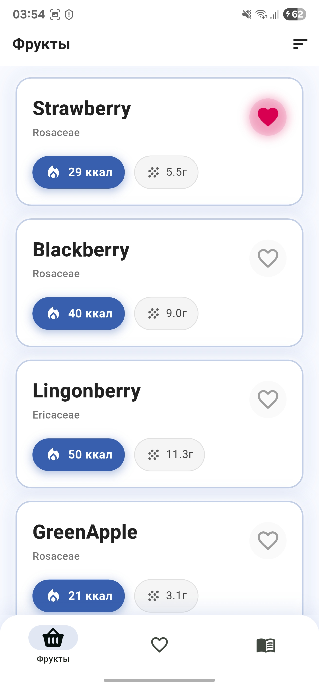
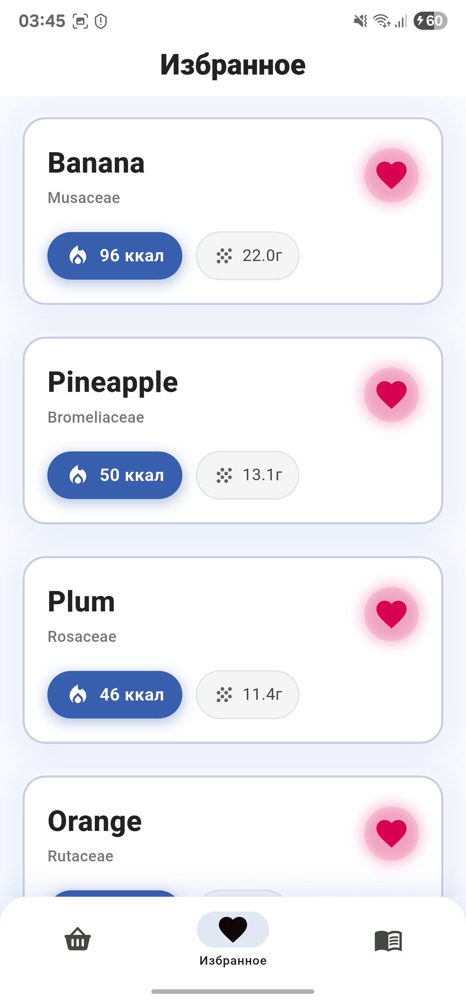
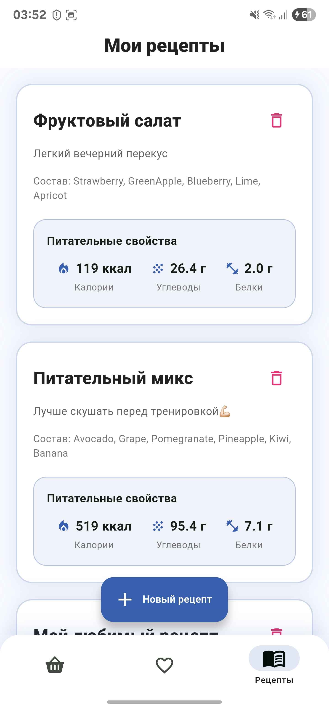
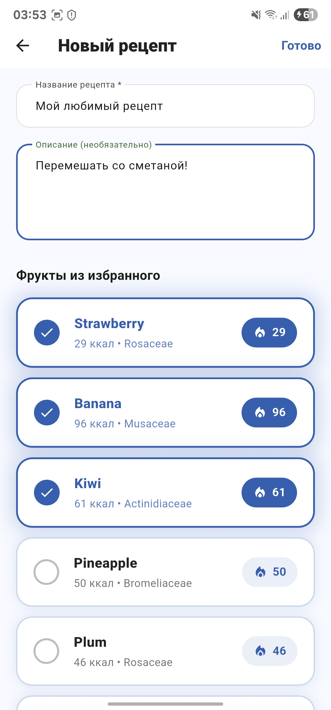
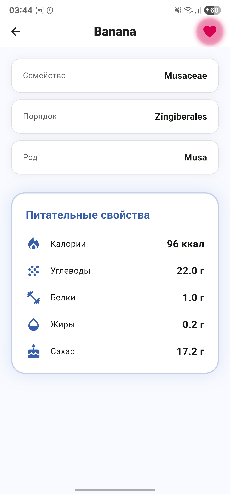

# Fruits — Приложение о фруктах и рецептах

Чистое, быстрое и элегантное приложение для любителей правильного питания.  
Просматривайте фрукты с научной точностью, сохраняйте избранное, создавайте персональные рецепты с автоматическим расчётом питательных свойств.

Приложение построено с акцентом на производительность, чистую архитектуру и премиальный пользовательский опыт.

## Содержание
-   [Скриншоты](#скриншоты)
-   [Функциональность](#функциональность)
-   [Технологический стек](#технологический-стек)
-   [Архитектура](#архитектура)
-   [Особенности реализации](#особенности-реализации)
-   [Установка и запуск](#установка-и-запуск)
-   [Генерация кода](#генерация-кода)
-   [API](#api)
-   [Автор](#автор)

## Скриншоты

| Главный экран                                  | Фильтры и сортировка                                  | Избранное                                           |
|:----------------------------------------------:|:-----------------------------------------------------:|:--------------------------------------------------:|
|  |  |  |
| **Список фруктов**                             | **Умные фильтры и сортировка**                        | **Ваше избранное — всегда под рукой**              |

| Мои рецепты                                    | Создание рецепта                                      | Детали фрукта                                       |
|:----------------------------------------------:|:-----------------------------------------------------:|:--------------------------------------------------:|
|  |  |  |
| **Автоматический подсчёт нутриентов**          | **Только из избранных фруктов**                       | **Полная научная информация**                      |

## Функциональность

- Просмотр полного списка фруктов из публичного API [FruityVice](https://www.fruityvice.com)
- Гибкая сортировка по названию и калорийности
- Умная фильтрация по питательным профилям: «Завтрак», «Тренировка», «Сытость», «Перекус», «Диета»
- Локальное избранное с мгновенной синхронизацией
- Детальная карточка фрукта с таксономией и полными нутриентами
- Создание собственных рецептов исключительно из избранных фруктов
- Автоматический подсчёт суммарных калорий, белков, жиров, углеводов и сахара в рецептах
- Полное оффлайн-хранение избранного и рецептов
- Современный, цельный дизайн с неоновыми акцентами и плавными анимациями

## Технологический стек

| Технология               | Версия     | Назначение                          |
|--------------------------|------------|-------------------------------------|
| **Flutter**              | 3.35.7     | Кроссплатформенная разработка       |
| **Dart**                 | 3.9.2      | Язык разработки                    |
| **Riverpod**             | 2.x        | Современное управление состоянием   |
| **Hive**                 | 2.x        | Лёгкое и быстрое локальное хранилище|
| **Dio**                  | 5.x        | HTTP-клиент с интерсепторами        |
| **json_serializable**    | 6.x        | Генерация сериализации из JSON      |
| **build_runner**         | —          | Code generation                     |
| **Clean Architecture**   | —          | Чёткое разделение слоёв             |

## Архитектура

Проект строго следует принципам **Clean Architecture**:<br>
lib/<br>
├── core/             # Общие утилиты, провайдеры, ошибки<br>
├── data/             # Репозитории, источники данных (API + Hive)<br>
├── domain/           # Модели, use cases, абстракции репозиториев<br>
└── presentation/     # UI: экраны, виджеты, провайдеры состояния<br>

## Особенности реализации

- Полная оффлайн-работа после первой загрузки
- Кэширование данных через Dio интерсепторы
- Атомарные операции с Hive (безопасное сохранение)
- Все состояния управляются через Riverpod (никакого setState в продакшене)
- 100% null-safety
- Единый премиум-дизайн на всех экранах

## Установка и запуск

```bash
# 1. Проверьте версию Flutter
flutter --version
# Flutter 3.35.7 • channel stable • Dart 3.9.2

# 2. Склонируйте репозиторий
git clone <ваш-репозиторий>
cd Flutter Fruits

# 3. Установите зависимости
flutter pub get

# 4. Сгенерируйте код (модели, Hive адаптеры, json_serializable)
flutter pub run build_runner build --delete-conflicting-outputs

# 5. Запустите приложение
flutter run
```

## Генерация кода

После изменения моделей обязательно выполняйте:

```bash
flutter pub run build_runner build --delete-conflicting-outputs
```

Поддерживаются:
- `@JsonSerializable()` — автоматическая сериализация JSON
- `@HiveType()` / `@HiveField()` — адаптеры для Hive

## API

Используется официальный публичный API:

- **Источник**: https://www.fruityvice.com
- **Эндпоинт**: `GET https://www.fruityvice.com/api/fruit/all`
- **Документация**: https://www.fruityvice.com/doc/index.html

## Автор

**Нелли Агапова** — Flutter‑разработчик<br>
**Связаться:**
<code><a href="https://t.me/Hidorysen"></a></code> <code><a href="mailto: agapova.nelli@gmail.com"></a></code> <code><a href="https://vk.com/nellmory"></a></code>

